# The Ultimate Guide: Extracting Joseph Smith's Doctrinal Principles from Historical Corpora

> **Purpose:** This document is a unified, authoritative reference synthesizing three independent research reports into a single, logically sequenced guide for building a provenance-grade pipeline to computationally extract and organize every principle taught by Joseph Smith, Jr. All unique insights, technical specifications, schema definitions, and methodological nuances from all source documents have been preserved and integrated.

---

## Table of Contents

1. [The Core Problem: Mediated Authorship and the Heterogeneous Corpus](#1-the-core-problem)
2. [Domain Insights: The Joseph Smith Corpus](#2-domain-insights)
3. [Ethical, Legal, and Cultural Considerations](#3-ethical-legal-cultural)
4. [Pipeline Architecture Overview](#4-pipeline-architecture)
5. [Stage 0: Prototype Strategy](#5-stage-0-prototype)
6. [Stage 1: Corpus Ingest, Normalization, and Provenance](#6-stage-1-ingest)
   - 6.1 Content-Addressable Store (CAS)
   - 6.2 TEI-Compliant XML Parsing
   - 6.3 Programmatic Generation of Clear Text
   - 6.4 Historical Text Normalization and OCR Mitigation
   - 6.5 Provenance Metadata Schema
   - 6.6 The Cardinal Modeling Rule: Never Merge Accounts
7. [Stage 2: Semantic Chunking for Context Preservation](#7-stage-2-chunking)
   - 7.1 Why Fixed-Length Chunking Fails
   - 7.2 The Mathematics of Semantic Segmentation
   - 7.3 Offset-Preserving Chunking
8. [Stage 3: LLM-Based Principle Extraction](#8-stage-3-extraction)
   - 8.1 Methodological Grounding
   - 8.2 Pydantic Schema Definition
   - 8.3 Prompting Strategy
   - 8.4 Asynchronous Orchestration and API Rate Limiting
   - 8.5 Execution at Scale: Batch API
9. [Stage 4: Hallucination Verification (Deterministic)](#9-stage-4-verification)
10. [Stage 5: Date Normalization (EDTF)](#10-stage-5-dates)
11. [Stage 6: Metadata Extraction (Dates, Audiences, Recorders)](#11-stage-6-metadata)
12. [Stage 7: Deduplication and Entity Resolution](#12-stage-7-deduplication)
    - 12.1 Two-Tier Architecture
    - 12.2 Probabilistic Record Linkage with Splink
    - 12.3 Semantic Deduplication via Cross-Encoders
    - 12.4 Near-Duplicate Detection Pipeline
13. [Stage 8: Inductive Clustering and Taxonomy Discovery](#13-stage-8-clustering)
    - 8.1 Embedding Strategy
    - 8.2 HDBSCAN vs K-Means
    - 8.3 BERTopic Two-Pass Pipeline
    - 8.4 Convergence Handling
14. [Stage 9: Local Vector Storage and Retrieval Infrastructure](#14-stage-9-storage)
    - 14.1 The sqlite-vec Paradigm
    - 14.2 Virtual Tables and K-Nearest Neighbor Search
    - 14.3 Full Database Schema
    - 14.4 Canonical Query Examples
15. [Human-in-the-Loop Validation](#15-human-in-the-loop)
16. [Evaluation Metrics and Test Sets](#16-evaluation-metrics)
17. [Reproducibility, Logging, and Deployment](#17-reproducibility)
18. [Model Reference and API Specifications](#18-model-reference)
19. [Implementation Timeline and Effort Estimates](#19-timeline)
20. [Complete Pipeline Architecture Diagram](#20-architecture-diagram)
21. [Decision Thresholds and Failure Modes](#21-decision-thresholds)
22. [Output Schema Reference](#22-output-schema)
23. [Key Caveats and Limitations](#23-caveats)
24. [References and Sources](#24-references)

---

## 1. The Core Problem: Mediated Authorship and the Heterogeneous Corpus

The computational extraction of discrete philosophical or theological principles from historical corpora presents a unique intersection of natural language processing (NLP), digital humanities, and systems architecture.

### 1.1 The Challenge of Mediated Authorship

Joseph Smith rarely wrote his own sermons or lengthy treatises; instead, he relied heavily on a fluctuating cadre of scribes and clerks. Consequently, the surviving text is often a composite of Smith's dictated words and the scribes' interpretations, phonetic abbreviations, and subsequent editorial smoothing. In many documents, only a tiny proportion were penned by the author himself, with the handwriting of the principal author interwoven with the handwriting of his scribes—sometimes side by side in the exact same letter or journal entry.

This mediated authorship creates profound challenges for data provenance. When a system extracts a principle, it must accurately capture not only the doctrine itself but the metadata surrounding its recording:

- The **date taught** (when the teaching was delivered)
- The **specific audience** addressed
- The precise **methodology of the recording** (by whom and when)

### 1.2 The King Follett Discourse as a Canonical Example

Landmark addresses, such as the 1844 King Follett Discourse, perfectly illustrate this complexity. Because 19th-century stenographic standards could not always capture rapid speech without gaps—often missing text while the scribe dipped their pen into an inkwell—the most complete versions of these sermons are amalgamations of several different transcripts.

The King Follett Discourse was recorded simultaneously by multiple scribes, including:
- **Willard Richards**
- **Wilford Woodruff**
- **Thomas Bullock**
- **William Clayton**
- **Samuel W. Richards** (later record)
- **George Laub** (later record)

Later church historians merged these four distinct sets of contemporaneous notes into a single "standard" version for publication in the *Times and Seasons* and the *History of the Church*. As the Joseph Smith Papers note: *"Because none of these individuals recorded the address stenographically, none of the accounts provides a complete record of what Smith said on that occasion."*

**The naive extraction failure mode:** If a naive extraction system were pointed at the complete, uncurated corpus, it would ingest the raw notes from Richards, Woodruff, Bullock, and Clayton, and the later amalgamated versions—and would extract the exact same foundational principle five or more times, attributing it to different textual locations and potentially different dates depending on the archival metadata attached to the specific file.

---

## 2. Domain Insights: The Joseph Smith Corpus

### 2.1 The Joseph Smith Papers Project (JSPP)

The **primary feedstock** for this pipeline is the completed Joseph Smith Papers Project, a 27-volume documentary edition containing:

| Metric | Value |
|--------|-------|
| Total pages | **18,822** |
| Total words | **7,452,072** |
| Footnotes | **49,687** |
| Journal entries | **1,306** |
| Letters | **643** |
| Revelations | **155** |
| Discourses, legal, financial records | Additional volumes |

*(Per the Church's June 27, 2023 completion announcement, quoting Elder Gerrit W. Gong)*

The JSPP offers:
- Verbatim, three-stage-verified transcripts
- Structured provenance for every document
- A detailed citation apparatus
- Published explicit "Note on Transcriptions" describing normalization (cancellations, insertions, "clear text" vs. diplomatic views)
- Both **diplomatic** and **"clear text"** views (choose one consistently and record which, as offsets differ between them)
- Individually published multiple accounts of key sermons

### 2.2 Multiple-Account Sermons

The King Follett Discourse survives in **seven extant accounts**, individually available. It was delivered to approximately **20,000 people** at the April 7, 1844 general conference (Church History Library, "Researching the King Follett Discourse").

**Caveat on amalgamations:** The widely circulated King Follett texts (Grimshaw's 1850s "Manuscript History" version, the *Teachings of the Prophet Joseph Smith* text) are editorial composites. Stan Larson's 1978 amalgamated text is itself a *secondary amalgamation*—"redundancies, and the parts added by Grimshaw without support in the contemporaneous notes, were removed in a modern amalgamation by Stan Larson in 1978." The pipeline should **flag and down-weight** these for provenance purposes while still allowing them into clustering as corroborating (not primary) evidence.

### 2.3 Source Type Taxonomy

The corpus is highly heterogeneous. Sources include:
- Personal journals (primary)
- Letters (primary)
- Contemporaneous scribe notes (primary)
- Amalgamated histories (secondary)
- Contemporary newspaper publications (secondary)
- Later transcriptions (secondary)
- Modern documentary editions (derived)

---

## 3. Ethical, Legal, and Cultural Considerations

### 3.1 Religious Text Ethics

Religious texts are culturally sensitive. As Hutchinson et al. note, sacred texts carry culturally important values and must be handled with respect. The pipeline must:

- Contextualize each principle historically
- Avoid misrepresenting teachings
- Acknowledge researcher bias and positionality
- Consider the perspective of the LDS community
- Clarify that this is for scholarly or religious study

### 3.2 Copyright and Data Use

- Joseph Smith's own writings (pre-1850) are largely **public domain**
- Modern compilations (e.g., Cannon & Hatch's *Teachings of the Prophet Joseph Smith*) **may be copyrighted**
- Use primary sources directly or ensure fair use
- *Ideas* or *facts* (the principles themselves) are not copyrightable, but verbatim quotes might be
- Avoid reproducing lengthy copyrighted text; paraphrase if necessary
- **Google's terms** allow using free-tier API inputs/outputs to improve models; for a research corpus this may be acceptable, but if any source has access restrictions, use a paid tier (which excludes training use)

### 3.3 Data Pipeline Output Framing

This pipeline **extracts and organizes; it does not adjudicate doctrine.** Convergence in embedding space is evidence of repeated/co-recorded teaching, not of theological truth or of what Joseph Smith "really meant." The system's value is provenance and discovery, and outputs should be presented as such.

---

## 4. Pipeline Architecture Overview

The recommended architecture is a **nine-stage pipeline**:

```
Immutable Content-Hashed Ingest
         ↓
TEI/XML Parsing + Clear Text Generation
         ↓
Historical Text Normalization (OCR Mitigation)
         ↓
Offset-Preserving Structural/Semantic Chunking
         ↓
Citation-Anchored LLM Extraction (Structured Output)
         ↓
Deterministic Quote Verification (rapidfuzz)
         ↓
Date Normalization (EDTF / python-edtf)
         ↓
Two-Tier Deduplication (Splink + Cross-Encoder)
         ↓
Embedding-Based Inductive Clustering (HDBSCAN/BERTopic)
         ↓
SQLite + sqlite-vec Local Storage
```

All data is persisted in a **single SQLite file** with the `sqlite-vec` extension.

---

## 5. Stage 0: Prototype Strategy (1–2 Days)

Before scaling, prototype on one well-documented event:

**Prototype target:** The King Follett Discourse primary accounts (Richards, Woodruff, Bullock, Clayton) as separate documents.

**Steps:**
1. Ingest the four primary accounts as separate documents
2. Hand-build the Pydantic schema and a 3-shot prompt
3. Run extraction synchronously
4. Verify quotes with `rapidfuzz`

**Success benchmarks:**
- ≥95% of admitted assertions have exact or ≥90-score fuzzy matches
- The accounts visibly co-cluster on shared doctrines
- If exact-match rate is low, normalization differs from the text the model saw—fix normalization **before scaling**

---

## 6. Stage 1: Corpus Ingest, Normalization, and Provenance

### 6.1 Content-Addressable Store (CAS)

Treat every source document as **immutable** and address it by the SHA-256 hash of its exact bytes. This provides:

- **Integrity:** Any corruption or silent edit is detectable
- **Deduplication:** Identical transcripts collapse to one object
- **Stable anchor:** Every extracted assertion references `document.content_sha256`, provably tied to an exact byte sequence

Store raw bytes under `objects/<sha256>` and keep the hash as the primary identifier in the database.

### 6.2 TEI-Compliant XML Parsing

Historical corpora of this magnitude, such as the Joseph Smith Papers Project digital archives, are typically encoded using the **Text Encoding Initiative (TEI) XML standard**, which captures not only linguistic text but also the physical realities of the manuscript: cancellations, insertions, line breaks, varying ink types, and later archival annotations.

**Recommended library:** `lxml` — provides Python bindings for the highly optimized C libraries `libxml2` and `libxslt`. It combines XML feature completeness with high-performance native APIs, allowing XPath queries that can selectively extract parts of the XML documents.

**Why not BeautifulSoup:** While BeautifulSoup provides an intuitive interface for navigating nested tags, processing thousands of extensive, deeply nested XML documents requires superior computational speed and memory efficiency that `lxml` provides.

### 6.3 Programmatic Generation of Clear Text

The diplomatic transcripts are densely layered with "barbed wire" notation—editorial markers that denote the physical state of the manuscript. Feeding raw XML with cancellation tags into an extraction LLM significantly degrades the model's performance. The parsing module must programmatically strip diplomatic markup to generate a standardized "clear text" stream.

| Parsing Operation | XML Tag Targets | Transformation Logic | Rationale |
|-------------------|-----------------|---------------------|-----------|
| **Ignore Cancellations** | `<del>`, `<cancel>` | Remove all enclosed text nodes completely | Ensures aborted thoughts or immediate scribal corrections do not pollute extracted doctrinal principles |
| **Accept Insertions** | `<add>`, `<insert>` | Retain enclosed text, integrate seamlessly into surrounding sentence | Captures the final intent of the author or scribe |
| **Resolve Insubstantial Emendations** | Contextual `<add>` within `<del>` | Automatically apply corrections for spelling and punctuation | Normalizes text such as "on Thirsday 31th arrived" → "on Thursday 31st arrived" |
| **Filter Later Redactions** | Archival notation tags | Exclude subsequent clerical notations, docketing, or archival markings | Ensures extracted principle represents the contemporaneous historical moment |
| **Standardize Formatting** | Hyphenation and Quotation tags | Omit end-of-line hyphens; standardize varying dashes; convert line-by-line quotation marks to block text | Removes formatting artifacts that disrupt the tokenization process |

By enforcing these parsing rules via `lxml` functions, the system transforms a complex archival document into a clean, machine-readable string. Critically, the parsing script must simultaneously extract and retain the document-level metadata (title, creation date, listed scribes) stored in the TEI Header (`<teiHeader>`), passing this metadata with the clear text string to the next stage.

### 6.4 Historical Text Normalization and OCR Mitigation

Even after XML parsing, the underlying text suffers from historical orthography and digitization errors. Secondary sources like early print publications are frequently digitized using OCR software, introducing severe transcription artifacts:

- Early modern fonts utilized the "long s" (ſ), which OCR engines routinely misclassify as "f"
- Difficulties recognizing reading order between columns and headers in densely packed periodicals
- 19th-century spelling was highly fluid (idiosyncratic abbreviations, phonetic spellings, archaic grammatical constructions)

**Recommended approach:** A lightweight, locally hosted transformer model fine-tuned on 19th-century English corpora for OCR post-correction and spelling normalization.

The most effective normalization systems evaluate the anomalous word within its surrounding context ("it uses the words on either side to disambiguate") to determine if a specific token sequence is a legitimate historical variant or a genuine OCR hallucination. This contextual leveraging is critical to ensure that distinct theological terms, geographical locations (Nauvoo, Kirtland), and idiosyncratic doctrinal phrasing unique to the corpus are **not aggressively autocorrected** into modern, unrelated vocabulary.

### 6.5 Provenance Metadata Schema

For each document record, capture beyond the hash:

| Field | Type | Description |
|-------|------|-------------|
| `sha256` | TEXT PRIMARY KEY | Content hash of exact bytes |
| `title` | TEXT | Document title |
| `source_type` | TEXT | `primary` vs `secondary` |
| `provenance_class` | TEXT ENUM | See below |
| `recorder` | TEXT | Who created this record |
| `event_date_edtf` | TEXT | When the principle was **taught** (EDTF format) |
| `event_date_earliest` | TEXT | Computed lower bound |
| `event_date_latest` | TEXT | Computed upper bound |
| `record_date_edtf` | TEXT | When **this record** was written down |
| `record_date_earliest` | TEXT | Computed lower bound |
| `record_date_latest` | TEXT | Computed upper bound |
| `repository` | TEXT | e.g., CHL |
| `citation` | TEXT | Full bibliographic citation |
| `normalized_text_sha256` | TEXT | Hash of the frozen normalized text |

**Provenance Class Enum (W3C PROV-style):**
- `autograph` — in Joseph Smith's own hand
- `dictated_revelation` — dictated by Joseph Smith, written by a scribe contemporaneously
- `contemporary_scribal_record` — clerk's same-day minutes
- `contemporary_diary` — e.g., Woodruff's journal
- `later_recollection` — reminiscence written years after
- `amalgamation` — an editor's later composite (e.g., the 1850s Grimshaw "Manuscript History" text)
- `published_edition` — modern documentary edition

**The three-date/agent split is the methodological heart of the system:**
- `event_date` — when the principle was *taught*
- `record_date` — when *this record* was written down (can equal event_date for same-day minutes, or be years later for recollections/amalgamations)
- `recorder` — who created this record (Willard Richards, Wilford Woodruff, Thomas Bullock, William Clayton, etc.)

Additional bibliographic fields: repository (e.g., CHL), series, page/volume, citation string.

Adopt an established vocabulary (W3C PROV, or DCAT/ISO 8000 fields) so provenance records are uniform; the PROV `wasDerivedFrom`/`wasAttributedTo`/`wasGeneratedBy` triad maps cleanly onto:
- (amalgamation derived from accounts)
- (account attributed to recorder)
- (account generated at record_date)

### 6.6 The Cardinal Modeling Rule: Never Merge Accounts

**Do NOT merge the multiple accounts of one sermon into a single canonical text.**

The King Follett Discourse is the canonical demonstration: it survives in independent contemporaneous longhand reports by Richards, Woodruff, Bullock, and Clayton (plus later records by Samuel W. Richards and George Laub and the amalgamated *Times and Seasons* text). Each report differs; some passages (e.g., the child-resurrection teaching) appear in some accounts and not others.

If you merge, you:
- Destroy provenance
- Fabricate a text no one recorded
- Lose the multiple-attestation signal

Instead, ingest each account as its own document, extract principles from each independently, and let clustering reveal that four records converge on "God was once a man." **Convergence then becomes *evidence* (multiple independent attestation) rather than an editorial assumption.**

---

## 7. Stage 2: Semantic Chunking for Context Preservation

### 7.1 Why Fixed-Length Chunking Fails

Language models possess finite context windows, and feeding entire volumes of journals or hundred-page amalgamation texts into the model simultaneously is both computationally inefficient and prone to information loss. Traditional fixed-length chunking (splitting arbitrarily every 1,024 characters with a sliding window overlap) is **highly detrimental** to principle extraction.

Theological and philosophical arguments are structurally complex: a core principle may be introduced as a premise in one paragraph, explored via a scriptural analogy in the next, and finalized in a concluding doctrinal statement. An arbitrary token cutoff can easily slice this doctrinal premise in half, separating the historical condition from the theological promise, or isolating a direct quote from its necessary interpretive context.

### 7.2 The Mathematics of Semantic Segmentation

**Semantic chunking** adaptively calculates breakpoints based on the semantic embedding similarity between sequential sentences. Modern AI frameworks (LlamaIndex, LangChain) integrate this as a core module.

The semantic chunking algorithm:

1. **Initial Parsing:** Divide the extensive historical text into small but coherent baseline groups, typically at the sentence level using a recursive character splitter
2. **Dense Vectorization:** Each individual sentence is vectorized using a local transformer-based bi-encoder (e.g., from the SentenceTransformers library), mapping each sentence into a high-dimensional vector space
3. **Cosine Similarity Calculation:** The system iterates through the sequence of sentence vectors, calculating the cosine distance between adjacent sentences. Cosine similarity is defined as the dot product of the vectors divided by the product of their magnitudes
4. **Adaptive Breakpoint Identification:** When the cosine distance between sequential sentences exceeds a predefined threshold, the algorithm identifies a semantic boundary and executes a chunk break. This threshold is often calculated dynamically based on the statistical distribution of distances across the entire document

**Result:** Each generated chunk contains complete thoughts. No thought gets cut off mid-expression. The resulting chunks will inherently vary in length—one philosophical aside might generate a chunk of 3,883 characters, while a lengthy doctrinal exposition might generate a chunk of 4,502 characters—but each represents a complete, uninterrupted semantic unit.

### 7.3 Offset-Preserving Chunking

**Every chunk must carry an absolute character offset back into its source** so model citations map to exact spans.

**Critical rules:**
1. Normalize once, at ingest, and *freeze* the normalized text; all offsets are relative to that frozen normalized string (store it, hash it). Never normalize again downstream or offsets drift.
2. Use **structural/semantic chunking** rather than blind fixed windows: split on document structure (paragraphs, dated journal entries, sermon sections) using a recursive splitter with a separator hierarchy `["\n\n", "\n", ". ", " ", ""]`
3. LangChain's `RecursiveCharacterTextSplitter(add_start_index=True)` records each chunk's `start_index` in metadata

**⚠️ Caveat (verified LangChain bug):** `add_start_index` returns intermittent `-1` and wrong offsets when a *token-based* length function or `from_tiktoken_encoder` with overlap is used (GitHub issues #17642, #18972, #29884). **Therefore prefer character-based splitting**, or compute offsets yourself:

```python
# Robust offset computation pattern
index = normalized_text.find(chunk, search_from)
# Store (start, start + len(chunk))
# Carrying chunk_start lets you convert any in-chunk match position
# to an absolute source offset by simple addition
```

Persist for each chunk: `document_sha256`, `chunk_index`, `char_start`, `char_end`, and the chunk text.

Keep modest overlap (10–30%) so a principle straddling a boundary isn't lost, but record each chunk's true offsets so overlap doesn't corrupt provenance.

---

## 8. Stage 3: LLM-Based Principle Extraction

### 8.1 Methodological Grounding

The task is a **"decompose-then-verify"** extraction in the lineage of FActScore, RARR, and especially **Claimify** (Dasha Metropolitansky and Jonathan Larson, *"Towards Effective Extraction and Evaluation of Factual Claims,"* accepted to the ACL 2025 Main Conference, arXiv:2502.10855v2, Microsoft Research).

Claimify's three stages map directly onto principle extraction:
1. **Selection** — keep only sentences with verifiable content
2. **Disambiguation** — extract only when the interpretation is confident; otherwise mark "cannot be disambiguated" and skip
3. **Decomposition** — rewrite into atomic, decontextualized claims

Claimify reports a 99% entailment rate and 87.6% coverage at 96.7% precision. Its key innovation: *"A key feature of Claimify is its ability to handle ambiguity and extract claims only when there is high confidence in the correct interpretation of the source text."*

Companion criteria from the claim-extraction literature (Kumar et al. 2025; Toulmin argumentation) to write into prompts: claims should be **atomic, faithful, decontextualized, verifiable, and declarative**.

Recent systems demonstrating the same provenance pipeline: **PaperTrail** (arXiv:2602.21045) and **CiteAudit** (arXiv:2602.23452).

### 8.2 Pydantic Schema Definition

```python
from pydantic import BaseModel, Field
from typing import Literal, Optional

class PrincipleAssertion(BaseModel):
    principle_statement: str        # atomic, decontextualized teaching
    verbatim_quote: str             # EXACT span copied from the chunk
    explicit_or_inferred: Literal["explicit", "inferred"]
    reasoning: str                  # why this is a principle (audit trail)
    confidence: float = Field(ge=0, le=1)
    audience_hint: Optional[str]    # e.g., "public conference", "private"
```

**For the Systems Architecture approach (compatible alternative schema):**

| Pydantic Class | Field Name | Data Type | Field Description / LLM Instruction |
|----------------|-----------|-----------|-------------------------------------|
| `ExtractionMetadata` | `scribe_name` | `Optional[str]` | The name of the specific scribe who recorded the text, if identifiable |
| `ExtractionMetadata` | `recording_temporality` | `str` | Assessment of whether recorded contemporaneously (live notes) or reconstructed later |
| `ExtractionMetadata` | `source_type` | `str` | raw journal, official history, dictated letter, or published periodical |
| `TaughtPrinciple` | `principle_statement` | `str` | Concise, modernized summary of the specific doctrinal, philosophical, or administrative principle taught |
| `TaughtPrinciple` | `direct_quote` | `str` | The exact, verbatim text snippet from the chunk most strongly supporting the principle |
| `TaughtPrinciple` | `date_taught` | `Optional[str]` | The exact or approximate historical date the principle was delivered |
| `TaughtPrinciple` | `audience` | `Optional[str]` | The specific individual, council, quorum, or general congregation addressed |
| `ChunkExtraction` | `principles` | `List[TaughtPrinciple]` | Comprehensive list of all distinct principles found within the provided text chunk |

**API invocation:**
```python
# Gemini approach
config={
    "response_mime_type": "application/json",
    "response_schema": list[PrincipleAssertion]
}
# or for Gemini 3 response_format form
```

This approach **transforms the LLM from a text generator into a precise data extraction tool.** If the underlying semantic chunk contains multiple principles, the model populates the list with multiple distinct objects. If the chunk is purely narrative or administrative (e.g., documenting travel arrangements) with no doctrinal principles, the model returns an empty list—acting as a highly effective semantic filter.

### 8.3 Prompting Strategy

- Instruct the model to copy `verbatim_quote` **character-for-character** from the provided chunk and to *never* paraphrase inside it—this is what makes deterministic verification possible
- Demand atomic principles ("one teaching per assertion")
- Force the explicit/inferred flag:
  - *explicit* = Joseph Smith states the principle directly
  - *inferred* = the principle is entailed but not stated verbatim (lower trust, separate handling)
- Use few-shot examples (2–3 hand-built examples drawn from a Joseph Smith sermon)
- Set a low/minimal "thinking level" for the bulk extraction model to control cost; raise it for the hard reasoning passes on the more capable model

**Hybrid approach from the NLP pipeline report:** A practical strategy is "extract-and-decompose" — first identify likely principle-containing sentences, then rephrase or split them into single-sentence principles. This can be implemented as:

1. **Sentence classification** → candidate identification
2. **LLM extraction** → structured output
3. **Refinement** → human review loop

**Context windowing:** Some principles require context. Keep paragraph or topic context (section headings, sermon dates) so that the extracted principle can be interpreted. Feed the LLM a block of text with date and speaker annotation, asking "What principles does Joseph Smith teach here?"

**Simple extraction prompt example (for initial prototype):**
```python
prompt = (
    "List doctrinal principles taught by Joseph Smith in the following text. "
    "Each principle should be one sentence, self-contained, and faithful to the source. "
    "Output in bullet points.\n\n"
    f"Text: \"{sermon_text[:1000]}...\""
)
```

### 8.4 Asynchronous Orchestration and API Rate Limiting

Processing the entirety of Joseph Smith's surviving writings requires thousands of discrete API calls. A synchronous processing loop would be prohibitively slow, while an uncontrolled asynchronous loop would trigger aggressive rate limits.

**Implementation using Python's `asyncio` library:**

**Semaphore for concurrency control:**
```python
# asyncio.Semaphore acts as a precise computational throttle
# Wrap the API execution function in:
async with self.semaphore:
    # API call here
```

**Token bucket / sliding window for RPM constraints:**
```python
# Maintain an asyncio.Lock() around a list of timestamped request records
# Before a new request, calculate requests made in the preceding 60 seconds
# If approaching the RPM limit, execute: await asyncio.sleep()
```

This precise, code-level pacing is vastly superior to naive `time.sleep()` implementations, as it dynamically maximizes throughput based on current API availability.

**Exponential backoff:** Use the `tenacity` library to wrap the execution block, providing automated exponential backoff for retries—waiting longer between each failed attempt—to smoothly recover from temporary network outages or brief rate limit resets.

**Local database caching layer:** Use `SQLiteCache` from `langchain-community`. If the pipeline crashes mid-execution or is restarted, previously processed semantic chunks are instantly retrieved from local disk rather than requiring a duplicate, costly API call.

### 8.5 Execution at Scale: Batch API

Build one Batch API JSONL line per chunk:
```python
{"key": chunk_id, "request": {...}}
```

Submit with:
```python
client.batches.create(
    model="gemini-3-flash-preview",
    src=uploaded_file.name
)
```

Poll until `JOB_STATE_SUCCEEDED`, then download the JSONL results keyed back to chunks.

**Cost advantages at 50% discount:**
- `gemini-3-flash-preview` batch: $0.25/$1.50 per 1M input/output tokens
- `gemini-3.5-flash` batch: $0.75/$4.50 per 1M input/output tokens
- `gemini-embedding-001` batch: $0.075/1M tokens

For a fixed corpus, batch is the correct execution mode for the bulk extraction and embedding passes.

---

## 9. Stage 4: Hallucination Verification (Deterministic)

**This stage is what makes the database "provenance-grade."**

The model's quotes cannot be trusted as-is because LLMs paraphrase and miscount. You never accept model-reported character positions. Instead take the model's `verbatim_quote` string and locate it in the source with exact matching, falling back to fuzzy matching for OCR/transcription variance.

**For every returned assertion:**

**Step 1 — Exact match:**
```python
pos = chunk_text.find(assertion.verbatim_quote)
if pos != -1:
    abs_start = chunk_char_start + pos
    abs_end = abs_start + len(quote)
    verification = "exact"
```

**Step 2 — Fuzzy fallback for transcription/OCR variance:**
```python
from rapidfuzz.fuzz import partial_ratio_alignment
result = partial_ratio_alignment(quote, chunk_text)
# Returns similarity score AND start/end indices
# Accept if score >= tuned threshold (start ~90)
# Record computed offsets, mark verification = "fuzzy"
```

RapidFuzz is C++-backed, MIT-licensed, and explicitly recommended for noisy/OCR text. It returns the start/end indices of the best alignment of the shorter string within the longer.

**⚠️ Important:** Constrain the `rapidfuzz` search to the **originating chunk** (not the whole document) to avoid cross-span false positives when a quote appears multiple times or the source has heavy duplication.

**Step 3 — Quarantine:**
If neither matches above threshold, the assertion is **NOT** admitted to the principles table; it is written to a `quarantine` table with the reason.

**Step 4 — Optional second-line grounding check:**
For higher assurance, run an NLI entailment check (e.g., a local DeBERTa-MNLI model, or RAGAS-style faithfulness) to confirm the `principle_statement` is actually entailed by the verified quote. This catches cases where the quote is real but the model's restatement drifts. This is the published faithfulness/groundedness distinction: a quote can be faithful (really present) yet the paraphrase ungrounded.

This "verify the model didn't make up the quote" approach aligns with "Verifiable by Design" (arXiv:2404.03862), which argues for generation that is *verifiable-by-design* via exact membership testing of quotes against the source corpus.

**Quarantine threshold calibration:** Start at ~90 fuzzy score; calibrate on a hand-checked sample.

---

## 10. Stage 5: Date Normalization (EDTF)

Historical dates are partial and uncertain: "the 7th of April, 1844"; "circa 1840s"; "spring 1831." Use the **Extended Date/Time Format (EDTF / ISO 8601-2)** as the storage representation.

EDTF expresses:
- Uncertainty: `?` → e.g., `1844-04-07?`
- Approximation: `~` → e.g., `1831-04~`
- Unspecified digits: `X` → e.g., `184X`

**Libraries:**

**`python-edtf`** (`pip install edtf`):
```python
# Parses natural-language date text to EDTF strings
# 'circa Feb 1812' → '1812-02~'
# 'ca. 1860s' → '186X~'
# Critically, computes lower_strict/upper_strict and fuzzy lower/upper bounds
# Sort by lower_strict for a natural order
```

**`undate`** (DH-Tech): A newer, calendar-aware alternative supporting EDTF/ISO8601 and partial dates with explicit `precision` (YEAR/MONTH/DAY) and `earliest`/`latest`. Useful if you need comparison across precisions.

**Recommended pattern:**
1. Have the LLM extract the *date expression as written* (a verbatim string) plus its own ISO guess
2. **Deterministically** re-parse the verbatim expression with `python-edtf`
3. Store the EDTF string + computed `date_earliest`/`date_latest` columns
4. Never trust the LLM's date arithmetic—parse it in code, exactly as you re-verify quotes

Store both `event_date` and `record_date` as EDTF + numeric bounds so "taught in 1843" or "recording lag" queries become simple range comparisons.

---

## 11. Stage 6: Metadata Extraction (Dates, Audiences, Recorders)

### 11.1 Date Extraction

- Use regexes (e.g., `\b(January|Jan)\s+\d{1,2},\s+\d{4}\b`) and date parsers (like the `dateparser` library)
- Apply NER models (spaCy's pre-trained or rule-based) to tag dates
- Spark NLP's *DateMatcher* combines regex and ML to find absolute/relative dates
- If the text lacks explicit dates, cross-reference known chronology (e.g., known sermon calendars) or metadata fields

### 11.2 Audience Extraction

Infer audience from context. Techniques include:

- If transcripts indicate the gathering (e.g., "April 7, 1844 general conference"), use that
- NER may catch named groups ("Brothers", "Sister Relief Society")
- Use a lookup of known congregations or events
- Heuristic rules (if speaker addresses "Friends", etc.) or external logs (journal entries)
- This is error-prone; **record confidence**

**Audience metadata** is recoverable from JSPP historical introductions (King Follett was a public general-conference address to ~20,000) and should populate the `audience` field.

### 11.3 Recorder and Recording Date

- In historical sources, the recording author (scribe) and date are often given (e.g., journal preface)
- Use regex or NER to find person names and nearby dates
- Look for patterns like "Recorded by * on DATE"
- Match names against a list of known secretaries (Oliver Cowdery, Sidney Rigdon, etc.)
- Cross-reference a catalog of Joseph Smith's scribes to improve accuracy
- Where unknown, leave fields null or "unknown"

### 11.4 Automation Strategy

Combine:
1. **Rule-based extraction** (regex templates for phrases like "Recorded," "Sermon by")
2. **ML-based NER** for PERSON and DATE categories
3. **Validation** with external references if available
4. **Confidence scores** for each extracted metadata item (high if NER score was high, low if only heuristics)

---

## 12. Stage 7: Deduplication and Entity Resolution

### 12.1 Two-Tier Architecture

Once raw data is successfully extracted, the local database will be heavily saturated with duplicates arising from two primary vectors:
- **Temporal reiteration** — Joseph Smith frequently reiterated core principles across multiple sermons separated by years
- **Scribal multiplicity** — major historical events were recorded by multiple scribes simultaneously

Resolving this requires a sophisticated, two-tiered deduplication architecture:
- **Tier 1:** Historical metadata deduplication via Probabilistic Record Linkage (Splink)
- **Tier 2:** Textual semantic deduplication via Cross-Encoder reranking

### 12.2 Probabilistic Record Linkage with Splink

Traditional deterministic matching logic (asserting a match only if `Date == Date AND Audience == Audience`) **catastrophically fails** on historical data due to missing values, differing date formats, and spelling variations.

**Recommended library: Splink** — a high-performance Python package based on the **Fellegi-Sunter model** for probabilistic record linkage.

**Process:**
1. **Define blocking rules:** broad constraints that create candidate pairs for comparison (e.g., "only compare records that share the same extracted year and month"), drastically reducing total pairwise comparisons
2. **Apply fuzzy matching:** Splink uses string distance metrics:
   - Levenshtein distance (minimum single-character edits to change one word into another)
   - Jaro-Winkler similarity
   - Example: `cl.levenshtein_at_thresholds("audience", 2)` produces "Great match", "Good match" (within distance 2), or "Bad match"
3. **Calculate match weights:** mathematically combines field-level weights to estimate the overall statistical probability that two disparate records point to the exact same historical event

**King Follett example:** Splink will probabilistically link records from Thomas Bullock and Wilford Woodruff into a single consolidated event cluster representing "The King Follett Discourse, April 7, 1844," despite the records originating from entirely different physical manuscripts with slight textual deviations.

### 12.3 Semantic Deduplication via Cross-Encoders

While Splink effectively resolves the metadata dimension, it cannot determine if two sentences express the exact same philosophical principle.

**Bi-encoder limitation:** Standard embedding pipelines use a bi-encoder that processes two texts independently, maps them to dense vector space, and calculates cosine distance between static vectors. Bi-encoders are exceptionally fast because embeddings for millions of records can be precomputed, stored, and compared with minimal overhead. However, for fine-grained theological principles, **standard bi-encoders lack the precision necessary** to differentiate between closely related but fundamentally distinct doctrines—they are prone to false positives when texts share vocabulary but diverge in meaning.

**Cross-Encoder advantage:** A cross-encoder does not precompute separate vectors. Instead, it processes both text sequences simultaneously, passing them together through the transformer network's multi-headed attention layers, allowing the model to compute rich, word-by-word cross-attention between the two principles.

**Example:** If one scribe recorded, "God himself was once as we are now," and another recorded, "God was once a man like us," the cross-encoder analyzes the deep relational context and syntactic dependencies of "God," "man," and "now/us" to output a single, highly accurate similarity score between 0 and 1.

**Hybrid pipeline (speed + accuracy):**
1. **Event Blocking:** Splink groups records by probabilistic event cluster, narrowing the search space
2. **Dense Retrieval (Bi-encoder):** A fast, local bi-encoder (Model2Vec or small SentenceTransformer) retrieves candidate pairs within the specific event cluster that share a baseline semantic similarity
3. **Semantic Reranking (Cross-encoder):** The local cross-encoder model re-evaluates candidate pairs. If the cross-encoder score exceeds a strict confidence threshold (e.g., > 0.85), the system merges the records

**Output:** The resulting merged record retains the most complete, articulate textual statement as the primary principle, while permanently archiving the alternate scribal variants as linked, subordinate quotes, providing a comprehensive view of the principle's transmission.

### 12.4 Near-Duplicate Detection Pipeline

Additional multi-step deduplication for repeated principles across sermons:

1. **Semantic similarity:** Embed each principle using a Sentence Transformer and compute cosine similarity. Flag pairs above a high threshold (e.g., ≥0.90) as candidate duplicates
2. **Lexical check:** For candidates, compute Levenshtein distance on the text to filter out false positives (use stricter similarity for shorter statements)
3. **Clustering:** Group duplicates into clusters (single-linkage clustering on similarities, or DBSCAN on embeddings). Use tools like SemDeDup
4. **Provenance within cluster:** Record all sources in a cluster; pick a canonical text (perhaps edit distance median). Label cluster with an ID

---

## 13. Stage 8: Inductive Clustering and Taxonomy Discovery

**Goal:** Discover the taxonomy of principles with no predefined categories, and reveal where independent records converge.

### 13.1 Embedding Strategy

Embed each **verified `principle_statement`** (optionally concatenated with its quote) using `gemini-embedding-001` with `task_type="CLUSTERING"`.

**Key choices:**
- The API exposes `RETRIEVAL_DOCUMENT`, `SEMANTIC_SIMILARITY`, `CLUSTERING`, `CLASSIFICATION` task types, which measurably change the vector geometry for the task
- Use `output_dimensionality=768` or `1536` (Matryoshka truncation) to cut storage/compute with minimal quality loss
- Run via the embeddings Batch API at $0.075/1M
- Note the **2,048-token input cap** on `gemini-embedding-001`—atomic principle statements are well under this

**Newer option:** `gemini-embedding-2` (multimodal, 8,192-token input, $0.20/1M) also exists but its embedding space is **incompatible** with `gemini-embedding-001`; for this text-only project `gemini-embedding-001` is the right default. If multimodal (manuscript images) becomes in-scope, consider `gemini-embedding-2`, but re-embed everything.

**Local alternative:** SentenceTransformers library with `all-MiniLM-L6-v2` or similar—fast, precomputable, and can serve as the bi-encoder stage in the deduplication hybrid pipeline.

### 13.2 HDBSCAN vs. K-Means

For an unknown number of principles with outliers, **HDBSCAN is the right primary tool:**

| Criterion | HDBSCAN | K-Means |
|-----------|---------|---------|
| Preset cluster count | Not required | Required |
| Cluster shape | Variable-density, variable-shape | Spherical |
| Outlier handling | Assigns genuine outliers to label −1 | Forces into nearest cluster |
| Use case | Genuine taxonomy discovery | Known number of categories |

**HDBSCAN settings:**
- Reduce dimensionality first with **UMAP** (tune `n_neighbors`, `n_components`) because density clustering degrades in very high dimensions
- Validate granularity with HDBSCAN's `min_cluster_size` / `cluster_selection_method` and the DBCV metric

**Known HDBSCAN trade-off:** Its aggressive outlier filtering can exclude a lot of data. For a completeness-oriented project, either lower `min_cluster_size`, or post-assign noise points to their nearest cluster centroid when appropriate.

### 13.3 BERTopic Two-Pass Pipeline

**BERTopic** packages the exact embed→reduce→cluster→label sequence and accepts custom embeddings and an LLM labeler. The recommended overall structure:

1. **Numeric clustering:** Embed → UMAP reduce → HDBSCAN cluster
2. **LLM labeling:** Feed each cluster's representative principles to the capable model, ask for a concise principle-category label and description

Published work (arXiv:2509.19365) confirms LLM-assisted labeling/topic-reduction on top of BERTopic yields cleaner, human-readable topics.

### 13.4 Convergence Handling (The Payoff)

Because each record is its own assertion, the multiple King Follett accounts each produce a "God was once a man" assertion; in embedding space these land together, and the cluster's membership—spanning several `recorder`s on one `event_date`—*is* the multiple-independent-attestation signal.

**Implementation:**
- Store cluster membership many-to-many (an assertion can belong to one HDBSCAN cluster; you may also run a second, finer agglomerative pass)
- Compute per-cluster provenance statistics: number of distinct records, distinct recorders, date span, primary-vs-secondary mix
- Use these statistics to weight assertions in downstream analysis

---

## 14. Stage 9: Local Vector Storage and Retrieval Infrastructure

### 14.1 The sqlite-vec Paradigm

Use **SQLite** (single file, zero-server, ideal for single-user local work) plus the **`sqlite-vec`** extension for vector storage and brute-force KNN search.

**Why not standalone vector databases (ChromaDB, Pinecone, Milvus):**
- Designed to run as separate server processes
- Demand substantial memory overhead
- Complicate local distribution
- Fundamentally violate the constraint of a self-contained, simple local application
- Computationally excessive and architecturally fragile for a localized Python pipeline

**sqlite-vec advantages:**
- Written entirely in pure C with no external dependencies
- Embeds a minimal, incredibly fast vector search engine directly into the local `.db` file
- Introduces native vector data types (`float32`, `int8`, and binary vectors)
- "Shockingly capable" for thousands-to-hundreds-of-thousands of vectors
- Keeps everything in one portable `.db` file with no external service
- Stores vector data directly within the database schema alongside clear text, extracted date, and Splink-resolved metadata

**Vector storage workflow:**
```python
from sqlite_vec import serialize_float32

# When pipeline extracts a principle and generates its semantic embedding:
embedding_array = model.encode(principle_statement)  # e.g., 768-dim float list
binary_blob = serialize_float32(embedding_array)
# Store binary_blob directly in the database schema
```

### 14.2 Virtual Tables and K-Nearest Neighbor Search

sqlite-vec utilizes SQLite's virtual table mechanism (`vec0_vtab`). The high-dimensional vector data is partitioned into these specialized virtual tables, which bypass traditional B-tree indexing in favor of algorithms specifically optimized for K-Nearest Neighbor (KNN) searches.

**SIMD hardware acceleration:** sqlite-vec uses Single Instruction, Multiple Data (SIMD) hardware acceleration (AVX or NEON instruction sets, automatically adapting to local machine architecture) to compute L2 (Euclidean) or cosine distance at sub-millisecond speeds.

**KNN search query:**
```sql
SELECT id, principle_statement, date_taught, distance
FROM principle_vectors
WHERE vector MATCH ?
ORDER BY distance
LIMIT 10;
```

**Hybrid query (semantic + metadata):**
```sql
-- Find principles conceptually similar to 'the nature of intelligence'
-- while requiring the date to be strictly between 1840 and 1844
-- All in a single elegant SQL statement
```

**Type safety benefit:** sqlite-vec enforces strict type safety via SQLite's low-level tagging system. Operational errors (such as attempting to compute the distance between mismatched vector formats or dimensions) are caught immediately at the database layer rather than failing silently during inference operations.

### 14.3 Full Database Schema

```sql
-- Documents (provenance-bearing)
CREATE TABLE documents (
    sha256 TEXT PRIMARY KEY,
    title TEXT,
    source_type TEXT,                   -- primary | secondary
    provenance_class TEXT,              -- autograph | dictated_revelation | ...
    recorder TEXT,
    event_date_edtf TEXT,
    event_date_earliest TEXT,
    event_date_latest TEXT,
    record_date_edtf TEXT,
    record_date_earliest TEXT,
    record_date_latest TEXT,
    repository TEXT,
    citation TEXT,
    normalized_text_sha256 TEXT
);

-- Chunks (offset-preserving)
CREATE TABLE chunks (
    id INTEGER PRIMARY KEY,
    document_sha256 TEXT REFERENCES documents(sha256),
    chunk_index INTEGER,
    char_start INTEGER,
    char_end INTEGER,
    chunk_text TEXT
);

-- Assertions (extracted principles, verified)
CREATE TABLE assertions (
    id INTEGER PRIMARY KEY,
    document_sha256 TEXT REFERENCES documents(sha256),
    chunk_id INTEGER REFERENCES chunks(id),
    principle_statement TEXT,
    verbatim_quote TEXT,
    char_start INTEGER,                 -- computed, verified offsets
    char_end INTEGER,
    explicit_or_inferred TEXT,
    verification TEXT,                  -- exact | fuzzy
    fuzzy_score REAL,
    confidence REAL,
    audience TEXT                       -- public | private | unknown
);

-- Clusters (discovered taxonomy)
CREATE TABLE clusters (
    id INTEGER PRIMARY KEY,
    label TEXT,
    description TEXT
);

-- Many-to-many assertion-cluster membership
CREATE TABLE assertion_clusters (
    assertion_id INTEGER REFERENCES assertions(id),
    cluster_id INTEGER REFERENCES clusters(id),
    membership_strength REAL,
    PRIMARY KEY (assertion_id, cluster_id)
);

-- Vector store (KNN search)
CREATE VIRTUAL TABLE assertion_vec USING vec0(
    assertion_id INTEGER PRIMARY KEY,
    embedding FLOAT[768]
);

-- Quarantine (unverifiable extractions)
CREATE TABLE quarantine (
    id INTEGER PRIMARY KEY,
    document_sha256 TEXT,
    chunk_id INTEGER,
    raw_json TEXT,
    reason TEXT
);
```

### 14.4 Canonical Query Examples

**Target query: all principles taught in 1843 to a public audience, from primary sources only, sorted by recording lag:**

```sql
SELECT 
    a.principle_statement,
    d.recorder,
    d.event_date_edtf,
    d.record_date_edtf,
    (julianday(d.record_date_earliest) - julianday(d.event_date_earliest)) AS recording_lag_days
FROM assertions a
JOIN documents d ON a.document_sha256 = d.sha256
WHERE d.event_date_earliest >= '1843-01-01'
  AND d.event_date_latest <= '1843-12-31'
  AND a.audience = 'public'
  AND d.source_type = 'primary'
  AND a.verification IN ('exact', 'fuzzy')
ORDER BY recording_lag_days DESC;
```

This is exactly why the three-date/agent split and the EDTF numeric bounds are in the schema: "recording lag" is `record_date − event_date`, computable only because the two are stored separately.

---

## 15. Human-in-the-Loop Validation

### 15.1 Annotation Tools

Use a text labeling UI for humans to review and correct extracted principles. Recommended tools:
- **Doccano** (open-source) — supports sequence labeling and text-to-text tasks
- **Label Studio** — alternative
- **Prodigy** — alternative

These allow multiple annotators, guideline enforcement, and export to JSON/CSV.

### 15.2 Active Learning / Hybrid Approach

Implement iterative loops where the model proposes candidates and humans confirm/correct:
- Repeatedly prompt the LLM for principles
- Have humans label misses
- Fine-tune the model on labeled data
- LLM + human hybrid labeling and active learning (querying uncertain cases) reduces annotation cost and improves accuracy

### 15.3 Quality Control

- Use **inter-annotator agreement** and validation sets
- Include disagreement resolution steps
- Annotators should label both principles AND metadata fields (dates, audience)
- Document consensus annotations as "ground truth" for testing

### 15.4 Feedback Loop

Corrections should feed back into updating the pipeline (e.g., refine regexes or re-train classifiers). Keep track of annotation statistics (number of labels, agreement rates).

---

## 16. Evaluation Metrics and Test Sets

### 16.1 Core Metrics

**Standard IE metrics** (precision, recall, F1) measuring how many correct principles the system finds vs. misses:
- Test: "Did we extract this known principle from a source?"
- Test: "Is this extracted principle actually in the text?"

### 16.2 Claim Quality Metrics

Evaluate:
- **Atomicity** — is each principle one self-contained statement?
- **Focus and coverage** — does output cover all key principles in a text?
- **Faithfulness** — does the principle accurately reflect the source meaning?
- **Decontextualization** — is it standalone?

Adapt FEVERFact metrics for faithfulness and decontextualization. Human judges may rate a sample.

### 16.3 Clustering Accuracy

If you create test clusters manually, measure **cluster purity** or **Rand Index** against ground truth clusters.

### 16.4 Test Datasets

- Assemble a test set by manually annotating a subset of documents (primary sources) with all principles
- Suggested starting point: a selection of well-studied sermons or sermons with known commentaries
- Benchmark: stage 1 should have **zero assertions in the live table without computed offsets**; quarantine rate < ~10% (higher means prompt or normalization problems)
- Update evaluation pipelines as in a CI system (e.g., using pytest)

### 16.5 Error Analysis

- Regularly review false positives/negatives
- For transparency, keep logs of model decisions (LLM outputs or rule triggers) to analyze mistakes

---

## 17. Reproducibility, Logging, and Deployment

### 17.1 Reproducibility

- Use **version control (Git)** for code and data schemas
- **Containerize** the environment (Docker/Conda) so text processing (OCR configs, Python libs, model versions) can be replicated
- Freeze random seeds where possible
- Record which JSPP text view ("clear text" vs. "diplomatic") was used for all offsets, since offsets differ between them

### 17.2 Logging

Implement logging at each pipeline stage:
- Log every document processed
- Number of principles extracted
- Confidence scores
- Any errors
- Quarantine entries with reasons

Store logs in structured files or a logging service. This aids debugging and audit.

### 17.3 Local vs. API Infrastructure

**Preferred (for sensitive data or cost control):** Open-source LLMs via `OnPrem.LLM`, `llama.cpp`, Hugging Face, or `vLLM`. These can be GPU-accelerated for speed.

**Cloud APIs** (e.g., Gemini) can augment tasks if offline quality is insufficient, but sends data externally.

**Hybrid approach:** Use cloud only for non-sensitive data; keep all actual principle assertions on-premise.

### 17.4 Compute and Storage

- **Embed-based dedup and LLM prompting** can be compute-intensive. Plan for a GPU server for model inference
- **Database:** SQLite (with sqlite-vec) for extracted principles and metadata with indices for fast lookup
- **Storage for raw texts and logs** should be organized (file system or object store)
- Estimated storage: ~10–100 GB depending on corpus size

### 17.5 Libraries and Tools

**Core pipeline:**
- `lxml` — XML/TEI parsing
- `spaCy` — NER, tokenization, sentence segmentation
- Hugging Face `Transformers` — LLMs, tokenizers
- `sentence-transformers` — embeddings
- `python-edtf` — EDTF date parsing
- `rapidfuzz` — fuzzy string matching for verification
- `scikit-learn` — clustering, metrics
- `umap-learn` — dimensionality reduction
- `hdbscan` — density-based clustering
- `bertopic` — topic modeling pipeline
- `Splink` — probabilistic record linkage
- `Pandas` — data handling
- `PyMuPDF` / `Tika` — PDF parsing
- `pytesseract` — OCR
- `dateparser` — date NLP
- `sqlite-vec` — vector extension for SQLite
- `tenacity` — exponential backoff and retries
- `asyncio` — asynchronous orchestration

**Annotation UI:**
- `Doccano`, `Label Studio`, or `Prodigy`

**Experiment tracking:**
- `MLFlow` or `Weights & Biases`

**Model management:** Keep track of model names/versions (e.g., "llama-13B-4bit") and any fine-tuning. Store prompt templates and settings used for LLM inference.

---

## 18. Model Reference and API Specifications

### 18.1 Gemini Model Mapping (as of June 2026)

| Requested Name | Current Gemini ID | Status | Context | Max Output | Input Cost | Output Cost |
|----------------|-------------------|--------|---------|------------|------------|-------------|
| "Gemini 3 Flash" | `gemini-3-flash-preview` | Preview | 1M tokens | 65,536 | $0.50/1M | $3.00/1M |
| "Gemini 3.5 Flash" | `gemini-3.5-flash` | **Stable/GA** | 1M tokens | — | $1.50/1M | $9.00/1M |
| Gemini Embedding | `gemini-embedding-001` | GA | 2,048 tokens | 3,072 dims | $0.15/1M | — |
| Gemini Embedding v2 | `gemini-embedding-2` | — | 8,192 tokens | — | $0.20/1M | — |

**Note:** `gemini-3.5-flash` uses the dotted ID form—there is no hyphenated `gemini-3-5-flash` form.

**Batch discounts:**
- `gemini-3-flash-preview` batch: $0.25/$1.50 per 1M input/output
- `gemini-3.5-flash` batch: $0.75/$4.50 per 1M input/output
- `gemini-embedding-001` batch: $0.075/1M

### 18.2 Embedding Configuration

- `gemini-embedding-001` is **text-only** with 3,072 default dimensions; Matryoshka truncation available to 1,536/768
- For this text-only project, `gemini-embedding-001` is the right default
- `gemini-embedding-2` is multimodal but its embedding space is **incompatible** with `gemini-embedding-001`; switching requires re-embedding everything

### 18.3 API Notes

- `gemini-3-flash-preview` is still a *preview* model; Google's docs warn preview models "may change before becoming stable and have more restrictive rate limits"
- `gemini-3.5-flash` is stable
- As of late May 2026, Google's rate-limits page no longer lists exact RPM/TPM/RPD per model/tier and redirects to AI Studio's live per-project view
- Free-tier *availability* of both Flash models is confirmed, but Batch/Flex modes and Search grounding are **not** free-tier
- Pricing and IDs should be re-checked at `ai.google.dev/gemini-api/docs/pricing` before a long run

### 18.4 Gemini Structured Output

Gemini 3-series models support JSON-Schema-constrained output via `response_format`/`response_schema` with Pydantic models passed directly. When the Pydantic model is passed to the API, the system uses Google's internal schema processing functions (such as `process_schema`) to convert the Pydantic validation rules into a strict JSON Schema format that the underlying model architecture natively understands and respects.

**Note:** Gemini's structured output mode supports a **specific subset** of the JSON Schema specification, not all features.

---

## 19. Implementation Timeline and Effort Estimates

### 19.1 Project Stages

| Stage | Focus | Duration | Notes |
|-------|-------|----------|-------|
| **0** | Prototype on King Follett accounts | 1–2 days | Success benchmark: ≥95% quote verification |
| **1** | Harden ingest & verification | 3–5 days | CAS, frozen normalization, EDTF dates, quarantine |
| **2** | Scale with Batch API | Cost-driven | 50% discount; route by difficulty |
| **3** | Cluster and label | Variable | Tune `min_cluster_size`, validate with DBCV and human spot-checks |
| **4** | Query layer & audit | Final | SQL views, optional Streamlit audit UI |

### 19.2 Full Project Timeline (Small Team: 1–2 Data Scientists + 1 Dev)

| Weeks | Activity |
|-------|----------|
| 1–2 | Data collection & OCR setup; gather all text files, run OCR, fix obvious errors, capture metadata |
| 3–6 | NLP pipeline development; build and test sentence segmentation and principle extraction (incorporate LLM prompts or classifier) |
| 7–9 | Metadata extraction and deduplication; develop regex/NER rules for dates/audience; implement embedding-based dedup and clustering |
| 10–12 | Annotation and validation; set up annotation tool (Doccano), label a sample of outputs, refine models |
| 13–14 | Evaluation and iteration; run metrics on a test set, fix pipeline bugs, improve precision/recall |
| 15 | Deployment and documentation; finalize database, logging, and methodology write-up |

**Effort estimate:** 2–3 person-months of development time, plus ongoing maintenance as new sources arrive.

**Computational resources:** One GPU machine for embeddings/LLM; standard CPU for OCR and parsing; ~10–100 GB storage depending on corpus size.

### 19.3 Stage 1 Hardening Benchmark

- Zero assertions in the live table without computed offsets
- Quarantine rate < ~10% (higher means prompt or normalization problems, not model problems)

### 19.4 Stage 3 Clustering Benchmark

- Tune `min_cluster_size` until the noise (−1) fraction is acceptable
- Start by inspecting: if >~30% of assertions are noise, lower `min_cluster_size` or post-assign to nearest centroid
- Validate with DBCV and human spot-checks of 10–20 clusters

---

## 20. Complete Pipeline Architecture Diagram

```mermaid
graph LR
    A[Raw Source Files<br/>PDF/Scans/TEI-XML] --> B[OCR & TEI/XML Parsing<br/>lxml + pytesseract]
    B --> C[Clear Text Generation<br/>Strip diplomatic markup]
    C --> D[Historical Normalization<br/>OCR post-correction]
    D --> E[Provenance Metadata Tagging<br/>W3C PROV schema]
    E --> F[Content-Addressable Store<br/>SHA-256 CAS]
    F --> G[Semantic Chunking<br/>Cosine-similarity breakpoints]
    G --> H[LLM Principle Extraction<br/>Pydantic structured output]
    H --> I[Hallucination Verification<br/>str.find / rapidfuzz]
    I --> J{Verified?}
    J -->|Yes| K[Date Normalization<br/>python-edtf EDTF]
    J -->|No| L[Quarantine Table]
    K --> M[Metadata Extraction<br/>NER + regex]
    M --> N[Two-Tier Deduplication<br/>Splink + Cross-Encoder]
    N --> O[Embedding Generation<br/>gemini-embedding-001]
    O --> P[Inductive Clustering<br/>UMAP + HDBSCAN + BERTopic]
    P --> Q[LLM Cluster Labeling<br/>gemini-3.5-flash]
    Q --> R[SQLite + sqlite-vec<br/>Local Vector Storage]
    R --> S[Consolidated Principles Dataset<br/>Query Layer + Audit UI]
    
    subgraph Review
        H --> T[Annotation UI<br/>Doccano/Label Studio]
        T --> N
        I --> T
    end
```



---

## 21. Decision Thresholds and Failure Modes

| Condition | Action |
|-----------|--------|
| Exact-match verification < 90% | Fix normalization, **don't loosen the fuzzy threshold** |
| Quarantine rate > ~10% | Investigate prompt or normalization problems |
| Clustering noise (−1) > ~30% | Reduce `min_cluster_size` / adjust UMAP before switching algorithms |
| Need cross-account *semantic* dedup beyond clusters | Add a pairwise `SEMANTIC_SIMILARITY` embedding pass, not a bigger LLM |
| Multimodal (manuscript images) becomes in-scope | Consider `gemini-embedding-2`, but re-embed everything (spaces are incompatible) |
| Per-document cost or 429 rate is material | Push everything through Batch and confirm live limits in AI Studio |

### 21.1 Inferred Principles Warning

**Inferred principles are epistemically weaker.** The `explicit_or_inferred` flag **must propagate** into clustering and reporting; do not let inferred assertions inflate "multiple attestation" counts that are meant to signal independent *explicit* witness.

---

## 22. Output Schema Reference

### 22.1 Principles Dataset (SQL or CSV/JSON)

| Field | Description |
|-------|-------------|
| `principle_id` | Unique ID for the principle (e.g., cluster identifier) |
| `principle_text` | Extracted principle statement text |
| `date_taught` | Date (or date range) when taught (EDTF format) |
| `audience` | Audience or occasion (e.g., "Nauvoo congregation") |
| `recorder` | Name of recorder (scribe) |
| `recording_date` | Date the teaching was recorded/transcribed |
| `source_title` | Title of document/source |
| `source_type` | e.g., "Journal", "Compilation", "Biography" |
| `source_location` | Page/paragraph or reference locator |
| `confidence` | Extraction confidence score (0–1) |
| `cluster_id` | ID linking duplicates (for canonicalization) |
| `verification` | "exact" or "fuzzy" |
| `fuzzy_score` | Fuzzy match score (if applicable) |
| `explicit_or_inferred` | "explicit" or "inferred" |
| `char_start` | Character offset in source document |
| `char_end` | Character end offset in source document |
| `notes` | Any additional comments (e.g., correction annotations) |

### 22.2 Database Table Reference

- **`documents`** — Source documents with full provenance metadata
- **`chunks`** — Text segments with absolute character offsets
- **`assertions`** — Extracted, verified principle assertions
- **`clusters`** — Discovered principle categories with labels
- **`assertion_clusters`** — Many-to-many membership table
- **`assertion_vec`** — Virtual table for vector KNN search
- **`quarantine`** — Unverifiable extractions for review

---

## 23. Key Caveats and Limitations

### 23.1 Model Specifics Are Preview-Volatile

`gemini-3-flash-preview` is still a *preview* model; Google's docs warn preview models "may change before becoming stable and have more restrictive rate limits." `gemini-3.5-flash` is stable. Pricing and IDs cited are current as of June 2026 and should be re-checked before a long run.

### 23.2 Rate Limits No Longer Publicly Tabulated

As of late May 2026, Google's rate-limits page no longer lists exact RPM/TPM/RPD per model/tier and redirects to AI Studio's live per-project view. The Batch API "enqueued tokens" quota for `gemini-3-flash-preview` specifically is not published. Plan to read live limits in AI Studio.

### 23.3 LangChain Offset Bug

As noted above, `add_start_index` is unreliable with token-based length functions. The safe path is character-based splitting or your own `find`-based offset computation.

### 23.4 Fuzzy Matching False Positives

Fuzzy matching can mis-locate when a quote appears multiple times or the source has heavy duplication. Always constrain the `rapidfuzz` search to the originating chunk (not the whole document), and keep the exact-match path primary.

### 23.5 Free-Tier Data Use

Google's terms allow using free-tier API inputs/outputs to improve models. For a research corpus this may be acceptable, but if any source has access restrictions, use a paid tier (which excludes training use).

### 23.6 Epistemic Limitations

This pipeline extracts and organizes; it **does not adjudicate doctrine.** Convergence in embedding space is evidence of repeated/co-recorded teaching, not of theological truth. Outputs should be presented as discovery tools, not theological authorities.

---

## 24. References and Sources

### 24.1 Corpus and Domain References

- **Joseph Smith Papers Project** — josephsmithpapers.org; 27-volume documentary edition, completed June 27, 2023
- Church's completion announcement quoting Elder Gerrit W. Gong (June 27, 2023)
- Church History Library, "Researching the King Follett Discourse" — history.churchofjesuschrist.org
- JSPP, "Accounts of the King Follett Sermon"
- JSPP, "Note on Transcriptions" — josephsmithpapers.org/articles/note-on-transcriptions
- JSPP, "Editorial Method for Journals, Volume 1"
- Stan Larson, 1978 amalgamated King Follett text
- Grimshaw's 1850s "Manuscript History" version
- BYU Studies, "The Latter-day Saint Reimaging of 'the Breath of Life' (Genesis 2:7)"
- Mormon Dialogue, "Why Wasn't The King Follett Discourse Canonized?"

### 24.2 Technical and Methodology References

- **Claimify:** Dasha Metropolitansky and Jonathan Larson, *"Towards Effective Extraction and Evaluation of Factual Claims"*, ACL 2025 Main Conference, arXiv:2502.10855v2, Microsoft Research
- **PaperTrail:** arXiv:2602.21045
- **CiteAudit:** arXiv:2602.23452
- **Verifiable by Design:** arXiv:2404.03862
- **BERTopic LLM-assisted labeling:** arXiv:2509.19365
- Kumar et al. 2025 — claim atomicity/faithfulness criteria
- Guo & Wei (2026) — provenance-aware OCR pipelines; span-level correction lineage
- Ullrich et al. (2025) — principle/claim extraction as a one-to-many text generation task
- Hutchinson et al. (2024) — ethical guidance for handling sacred texts with cultural sensitivity
- FActScore, RARR — claim decomposition and verification lineage

### 24.3 Library and Tool References

- **Splink:** moj-analytical-services.github.io/splink; GOV.UK Data in Government blog
- **sqlite-vec:** asg017/sqlite-vec on GitHub; Stephen Collins on Medium
- **LangChain offset issues:** GitHub issues #17642, #18972, #29884
- **LangChain, LlamaIndex** — Chunking Techniques docs; LanceDB blog
- **SentenceTransformers documentation** — sbert.net
- **Semantic Chunker** — LlamaParse Developer Documentation
- **python-edtf** — pip install edtf
- **undate** — DH-Tech
- **Firecrawl** — "Best Chunking Strategies for RAG (and LLMs) in 2026"
- Google AI for Developers, Structured Outputs documentation
- Robin Linacre, "Deduplicating 7 million records in two minutes with Splink"
- **SemDeDup** — NVIDIA NeMo Curator semantic deduplication
- Spark NLP DateMatcher documentation
- **OnPrem.LLM** — local LLM backends (llama.cpp, Hugging Face, vLLM)
- Digital Orientalist, "Using Python to Analyze Greek New Testament Manuscripts"
- Komax.github.io, "Parsing TEI XML documents with Python"
- arXiv:2502.01205 — "OCR Error Post-Correction with LLMs in Historical Documents: No Free Lunches"
- Ted Underwood, "A half-decent OCR normalizer for English texts after 1700"
- DHQ Static, "A Teaching Tool for TEI to Linked Data Transformation"
- Diva-Portal, "Advancing Entity Resolution: Creating a Unified Pipeline"
- Zenodo dh2009.txt — mediated authorship in historical corpora
- Gemini API Pricing: ai.google.dev/gemini-api/docs/pricing
- Gemini Structured Output documentation: ai.google.dev/gemini-api/docs/interactions/structured-output

---

*This document was synthesized from three independent research reports:*
1. *"Building a Provenance-Grade Principle-Extraction Pipeline for Joseph Smith's Corpus: A Technical Methodology Report"* (Gemini/compass artifact)
2. *"Executive Summary: Building a Robust Local Pipeline to Extract Joseph Smith's Doctrinal Principles"* (deep-research-report)
3. *"Computational Extraction of Doctrinal Principles from Heterogeneous Historical Corpora: A Systems Architecture Report"* (Joseph_Smith_Principles_Extraction_System)

*All three were merged to preserve every unique insight, eliminate repetition, and organize findings into a logically sequenced reference guide.*
